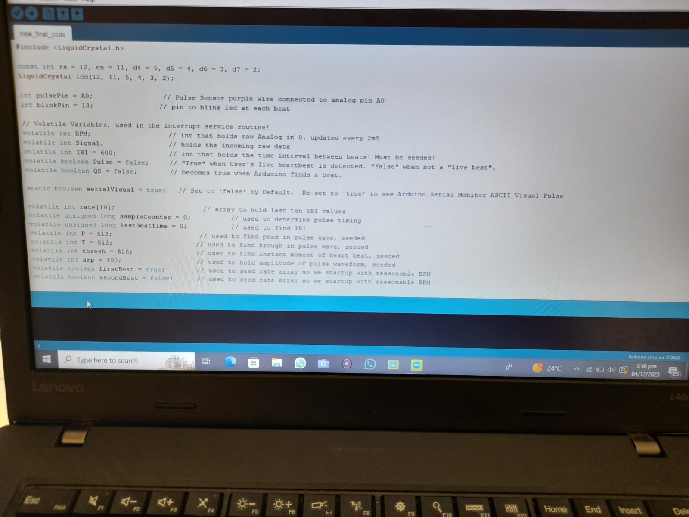
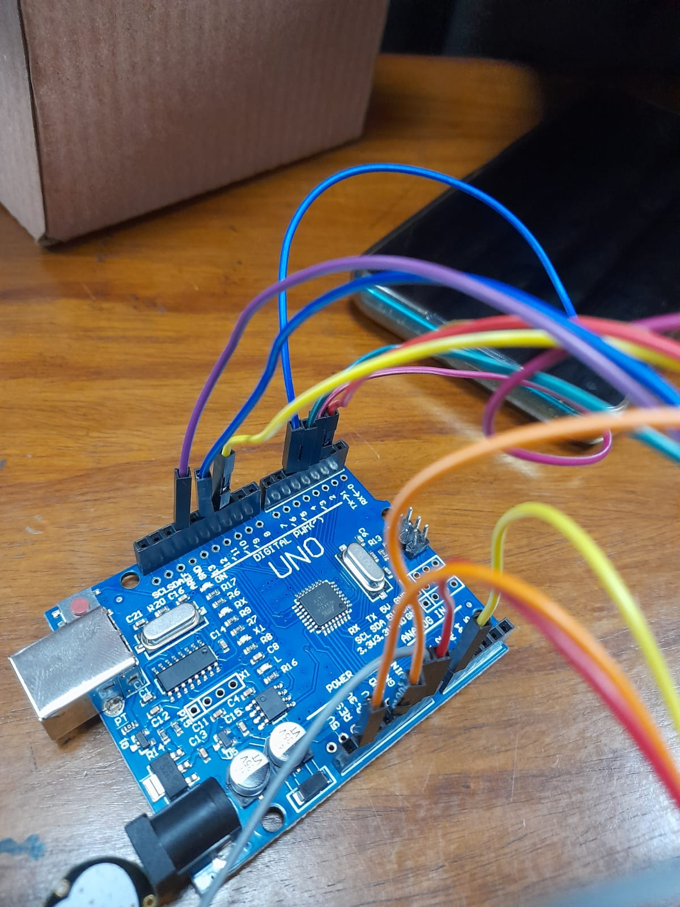
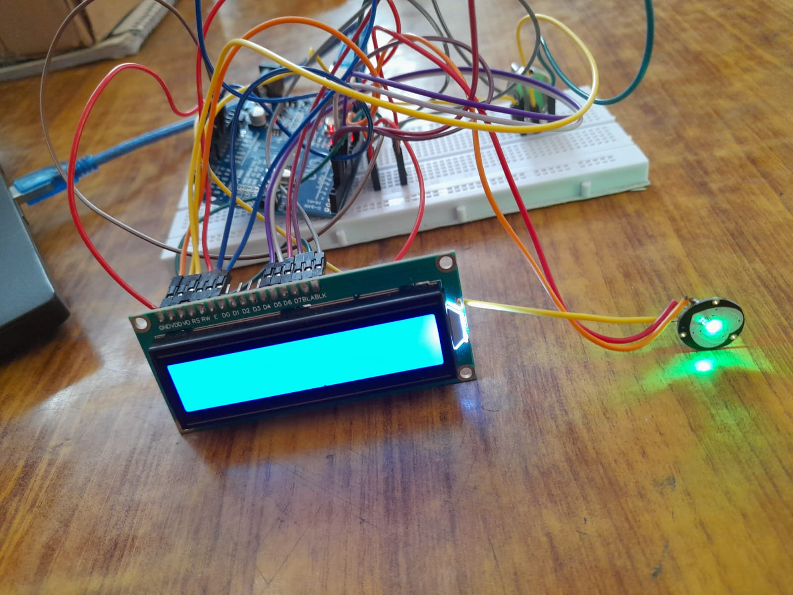
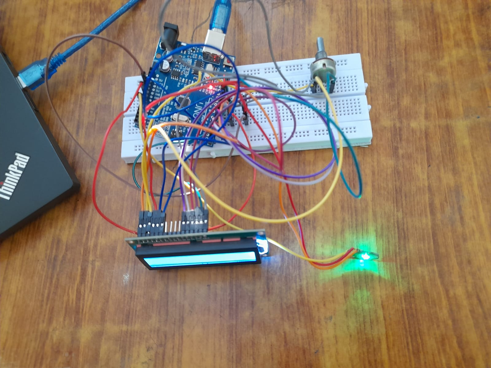
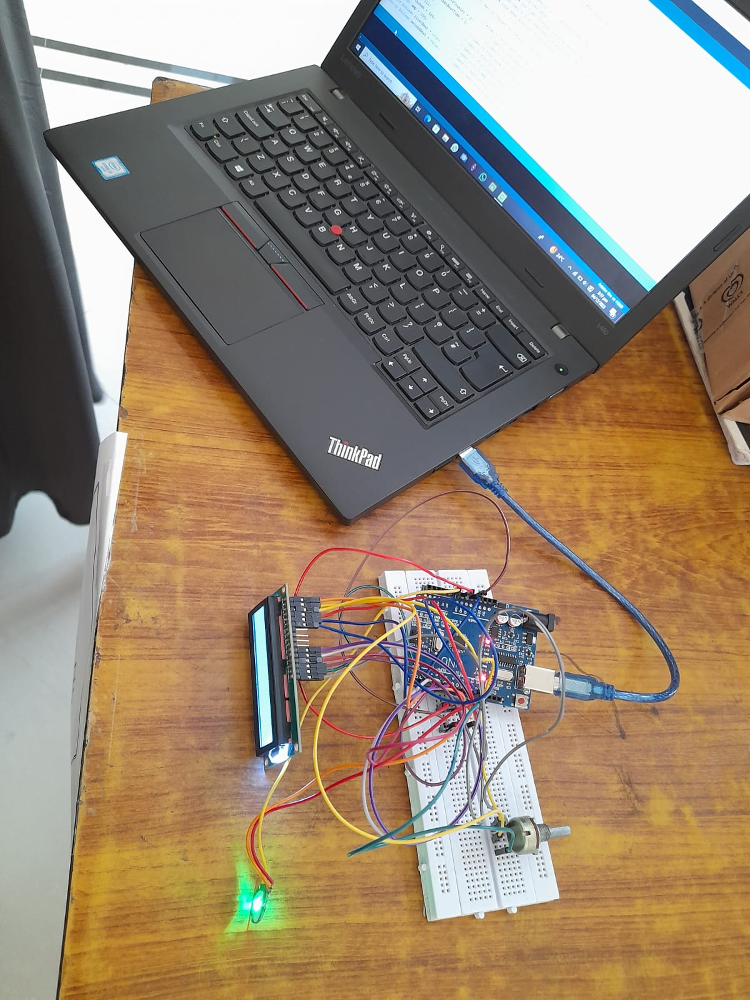
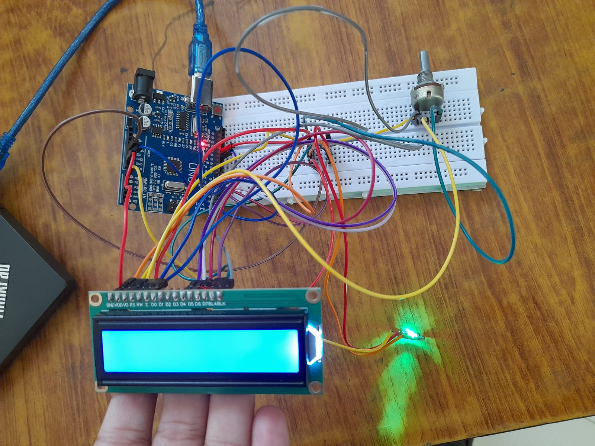

# Pulse Sensor System – Digital Logic Design Project

As part of our **Digital Logic Design (DLD)** course, our team successfully designed and implemented a **Pulse Sensor System** using:

- 🧠 Pulse Sensor Module  
- 🖥️ Arduino UNO  
- 📺 LCD Display

The system was capable of detecting the user's heartbeats via the pulse sensor, processing the data using the Arduino UNO, and displaying the pulse rate on the LCD screen in real time.

This project was a **collaborative effort** that showcased our combined skills in circuit design, microcontroller programming, and hardware integration — applying key concepts from digital logic and embedded systems.

## 🔧 Components Used
- Pulse Sensor Module  
- Arduino UNO  
- 16x2 LCD Display  
- Breadboard, jumper wires, resistors

## 💻 Technologies
- C++ (Arduino IDE)  
- Basic digital logic components  
- Serial communication

## 📸 Project Image

## My Role
I contributed to the **circuit setup**, and **testing** phases of the project.

